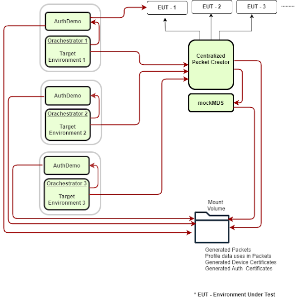

# Automation Tests

## Overview
This repo contains test framework for end2end testing of MOSIP functionality.  The following functionality is covered
1. Registration 
1. Pre-registration + registration 
1. Authentication

## Components

1. API automation [mosip-functional-tests](https://github.com/mosip/mosip-functional-tests/)
1. E2E automation (this repo)
1. Packet Generation tool (this repo)

## Execution flow	

## Prerequisites

For Windows

* Java (11) and Maven  software should be installed on the machine from where the automation tests will be executed
* Git bash
   
## Repository details
Below are repository details of various modules used for the automation

### DSL Orchestrator
* Authentication Demo Service in [mosip-functional-tests](https://github.com/mosip/mosip-functional-tests/).
* Automation tests in [mosip-functional-tests](https://github.com/mosip/mosip-functional-tests/).
* [IVV Orchestrator](mosip-acceptance-tests/ivv-orchestrator/)

### Packet Utility(Packet Generation tool)
* [Mosip Test Data Provider](mosipTestDataProvider)
* [Mosip-Packet-Creator](mosip-packet-creator)

## Build and run
### To build end to end automation 
* Authentication Demo Service `mvn clean install`
* Automation Tests `mvn clean install`
* Acceptance Tests(location: mosip-automation-tests\mosip-acceptance-tests\ivv-orchestrator) `mvn clean install`
    - After Successful build will get the jar (ivv-orchestrator-0.1.1-SNAPSHOT-jar-with-dependencies.jar)

### To build Packet Utility
* Mosip Test Data Provider `mvn clean install`
* Mosip-Packet-Creator `mvn clean install`
    - After successful build will get the jar (mosip-packet-creator-0.0.1-SNAPSHOT.jar)
    - Packet Utility is used to create and uploads the packet which is used by the e2e automation

## Configuration - Packet Utility
1. Download [deploy folder](deploy)
1. Download Anguli from `https://dsl.cds.iisc.ac.in/projects/Anguli/` 
1. Iris database take permission from IIT Delhi to use IRIS Database from `https://www4.comp.polyu.edu.hk/~csajaykr/IITD/Database_Iris.htm` 
1. Download vcredist_x86.exe `https://www.microsoft.com/en-us/download/details.aspx?id=48145`
  ( Note : one time activity it will be installed as a service , no need to do it again for any further update)
1. Download and build MockMDS from [mosip-mock-services](https://github.com/mosip/mosip-mock-services/).
1. Set device certificates as per the environment and keep certificate under each modality keys. See [MDSdevicecert.md](https://github.com/mosip/mosip-infra/blob/1.2.0-rc2/deployment/sandbox-v2/docs/MDSdevicecert.md).
1. Start Mock mds by executing batch file (location: deploy\mockmds\run.bat) and verify its running on port 4501(default port)
1. Update `..\config\application.properties` with the following details
      * `mosip.test.baseurl`=https://qa.mosip.net
      * `server.port`=8080
      * `mosip.test.temp`=/temp/ (create empty 'temp` folder inside current directory e.g. D:\temp)
1. Update ..\resource\config\default.properties with the following details 
      * `urlBase`=https://qa.mosip.net -is the base url of the target MOSIP server.
1.	Update ..\run.bat as mentioned below
	`spring.config.location` should have the absolute path of application.properties, e.g.
    `-Dspring.config.location=..\deploy\config\application.properties`
1.	Keep mosip-packet-creator-0.0.1-SNAPSHOT.jar and execute run.bat
1.	Verify if the Packet utility is running by hitting `http://localhost:8080/swagger-ui.html#/ `
1.	For any failure in the packet utility verify the logs location: deploy\runlog.txt
1. Deploy folder structure looks like

  

## Configuration - DSL Orchestrator
1. Build the E2E_Automation acceptance test project and get the jar  `mosip-automation-tests\mosip-acceptance-tests\ivv-orchestrator\target`
2. Take the config folder from the mosip-acceptance test project `mosip-automation-tests\mosip-acceptance-tests\ivv-orchestrator\src\main\resources\config`
3. Take the local folder from the mosip-acceptance test project `mosip-automation-tests\mosip-acceptance-tests\ivv-orchestrator\src\main\resources\local`
4. End to end folder structure looks like below

1. Command to execute the e2e automation (ivv-orchestrator-0.1.1-SNAPSHOT-jar-with-dependencies.jar) utility with below vm arguments
     * java `-Denv.user`=environment name `-Denv.endpoint`=baseurl `-Denv.testLevel`=smoke `-DscenarioSheet`=<scenariosheetname> `-Denv.langcode`=eng -jar ivv-orchestrator-0.1.1-SNAPSHOT-jar-with-dependencies.jar
     * `env.user`  =  environment name example qa, qa2, dev
     * `env.endpoint` = base environment
     * `scenarioSheet` = scenariosheet.csv ( which we want to execute)
     * `env.testLevel` = smoke
     * `env.langcode`= eng (default language of the target environment)
1. After the execution completes, the test report can be found in the path `..\testng-report\emailable-report.html`

## DSL execution logs
1. We can verify the failure in the logs `mosip-acceptance-tests\ivv-orchestrator\src\logs\mosip-api-test.log`

## License
This project is licensed under the terms of [Mozilla Public License 2.0](LICENSE).
