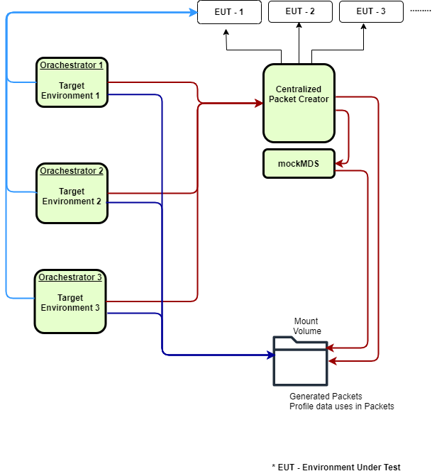

# Automation Tests

## Overview
This repo contains test framework for end2end testing of MOSIP functionality.  The following functionality is covered
1. Registration 
1. Pre-registration + registration 
1. Authentication

## Components

1. API automation [mosip-functional-tests](https://github.com/mosip/mosip-functional-tests/)
1. E2E automation (this repo)
1. Packet Generation tool (this repo)
   

## Execution flow	


## Prerequisites

For Windows/Linux

* Java (21) and Maven  software should be installed on the machine from where the automation tests will be executed
* Git bash
   
## Repository details
Below are repository details of various modules used for the automation

### DSL Orchestrator
* apitest-commons in [mosip-functional-tests](https://github.com/mosip/mosip-functional-tests/).
* [IVV Orchestrator](mosip-acceptance-tests/ivv-orchestrator/)

### Packet Utility(Packet Generation tool)
* [Mosip Test Data Provider](mosipTestDataProvider)
* [Mosip-Packet-Creator](mosip-packet-creator)

## Build and run
### To build end to end automation 
* apitest-commons `mvn clean install -Dgpg.skip`
* Acceptance Tests(location: mosip-automation-tests\mosip-acceptance-tests\ivv-orchestrator) `mvn clean install -Dgpg.skip`
    - After Successful build will get the jar (dslrig-ivv-orchestrator-version-SNAPSHOT-jar-with-dependencies.jar)

### To build Packet Utility
* Mosip Test Data Provider `mvn clean install -Dgpg.skip`
* Mosip-Packet-Creator `mvn clean install -Dgpg.skip`
    - After successful build will get the jar (dslrig-packetcreator-version-SNAPSHOT.jar)
    - Packet Utility is used to create and uploads the packet which is used by the e2e automation

## Configuration - Packet Utility
1. Download `centralized folder from src/main/resources/dockersupport
1. Under `mosip-packet-creator
1. Biometric Devices= Contains Mockmds specific files.
1. config= application.properties configurations
1. config=default.properties
1. dslConfig=dsl.properties
1. mapper=demographic mappings environment specific or default setup.
1. privatekeys=machine specific details for encrypting and signing the packet.					
1.	Update ..\run.bat as mentioned below
1.	Keep mosip-packet-creator-1.3.0-SNAPSHOT.jar and execute run.bat
1.	Verify if the Packet utility is running by hitting `http://localhost:8080/v1/packetcreator/swagger-ui.html#/`
1.	For any failure in the packet utility verify the logs location: mosip-packet-creator\PacketUtilityRunlog.txt


## Configuration - DSL Orchestrator
1. Build the E2E_Automation acceptance test project and get the jar  `mosip-automation-tests\mosip-acceptance-tests\ivv-orchestrator\target`
2. Take the config folder from the mosip-acceptance test project `mosip-automation-tests\mosip-acceptance-tests\ivv-orchestrator\src\main\resources\config`
3. Update kernel properties secret keys based on the env details inside `mosip-functional-tests\apitest-commons\src\main\resources\config\Kernel.properties`
1. Update dsl file property `scenariosToExecute=2` update scenario number for execution and keep this empty to run entire full suite
1. Command to execute the e2e automation (dslrig-ivv-orchestrator-version-SNAPSHOT-jar-with-dependencies.jar) utility with below vm arguments
     * java `-Denv.user`=environment name `-Denv.endpoint`=baseurl -jar dslrig-ivv-orchestrator-version-SNAPSHOT-jar-with-dependencies.jar
     * `env.user`  =  environment name example qa, qa2, dev
     * `env.endpoint` = base environment
1. After the execution completes, the test report can be found in the path `..\testng-report\emailable-report.html`

## DSL execution logs
1. We can verify the failure in the logs `mosip-acceptance-tests\ivv-orchestrator\src\logs\mosip-api-test.log`

## Importing the Project into an IDE

To work with the project in an Integrated Development Environment (IDE), follow these steps:

1.**Supported IDEs:**
   - IntelliJ IDEA (Recommended)
   - Eclipse IDE

2.**Prerequisites:**
   - Ensure **Java 21** and **Maven** are installed and configured in your system.
   - Git Bash (for cloning the repository and running scripts).

3.**Steps to Import the Project:**
   - Clone the repository using the command:
     ```
     git clone https://github.com/mosip/mosip-automation-tests.git
     ```
   - Open the IDE of your choice.
   - Select **File > Open Project** (or **File > Import** in Eclipse).
   - Navigate to the directory where the repository is cloned.
   - Select the `pom.xml` file and import the project as a **Maven Project**.

4.**Dependencies:**
   - The project uses Maven for dependency management. Ensure all dependencies are downloaded by running:
     ```
     mvn clean install -Dgpg.skip
     ```
     This step will also verify that the project builds successfully.

5.**Environment-Specific Configurations:**
   - Update the `Kernel.properties` file and other configuration files under the `src/main/resources/config` directory as per your environment setup.

6.**Run the Project:**
   - After importing, locate the main class to run the project:
     - For DSL Orchestrator: `io.mosip.testrig.dslrig.ivv.orchestrator.TestRunner`.
   - Use the IDE’s **Run** feature or execute the JAR file with VM arguments for testing.

By following these steps, you can seamlessly set up and work with the project in your preferred IDE.

## Docker setup build
1. Deploy Packet creator
	-Use these branches of code.
	`https://github.com/mosip/mosip-automation-tests/tree/release-1.2.0.1`
	`https://github.com/mosip/mosip-helm/tree/1.2.0.1/charts/packetcreator`
1. Deploy Dsl testrig
	-Use these branches of code.
	`https://github.com/mosip/mosip-automation-tests/tree/release-1.2.0.1`
	`https://github.com/mosip/mosip-helm/tree/1.2.0.1/charts/dslorchestrator`
1. Orchestrator Config maps setup


1. To run particular scenario `scenariosToExecute=2` update scenario number for execution and keep this empty to run entire full suite
1.Scenario sheet gets picked internally placed at this path `https://github.com/mosip/mosip-automation-tests/blob/release-1.2.0.1/mosip-acceptance-tests/ivv-orchestrator/src/main/resources/config/scenarios.json`
1. Report gets generated on minio in the mentioned S2 bucket folder in configmaps. For example pick similar to below two reports one is testng report other is extent report.
  -DSL-api-internal.qa-release.mosip.net-full-run-1707833456032-report_T-161_P-1_S-63_F-97
  -ExtentReport-DSL-api-internal.qa-release.mosip.net-full-run-1707833456032-report_T-161_P-1_S-63_F-97

## License
This project is licensed under the terms of [Mozilla Public License 2.0](LICENSE).

